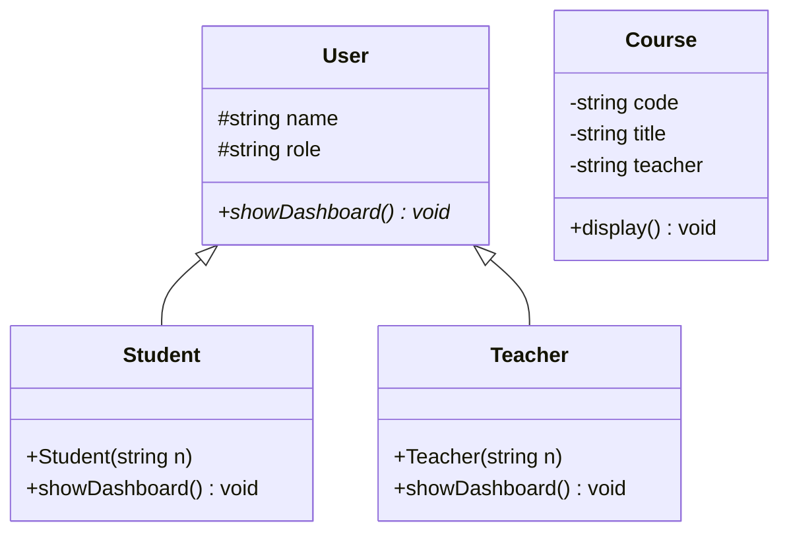
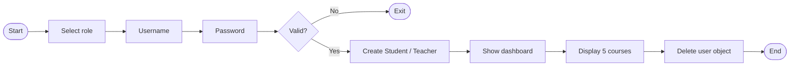

<div align="center">


<br>


**[About](#-about) · [Features](#-features) · [Architecture](#-architecture) · [Getting Started](#-getting-started) · [Courses](#-available-courses) · [OOP Concepts](#-oop-concepts) · [Scope](#-current-scope) · [License](#-license)**

</div>

---

## 📌 About

**Digital Classroom Management System** is a console-based C++ project that demonstrates core Object-Oriented Programming concepts through a simple classroom scenario. Users log in as a **Student** or a **Teacher**, see a role-specific dashboard, and view the list of available courses.

> This README describes the console-based C++ source in this repository. The project has no GUI, database, networking, or pre-built executable.

---

## ✨ Features

| | Feature | Details |
|---|---|---|
| 🔐 | **Role-based login** | Role → Username → Password → Authentication |
| 👨‍🎓 | **Student dashboard** | Courses, attendance, assignments, results |
| 👨‍🏫 | **Teacher dashboard** | Manage courses, attendance, assignments, results |
| 🔄 | **Runtime polymorphism** | A `User*` pointer calls the correct `showDashboard()` |
| 📚 | **Course list** | 5 `Course` objects stored in `vector<Course>` |
| 💾 | **Memory handling** | Objects created with `new`, released with `delete` |

---

## 🏗️ Architecture



`User` is the base class. `Student` and `Teacher` inherit from it and override `showDashboard()`. `Course` is an independent class that models course information.

### Program flow



---

## 🚀 Getting Started

This is a single-file C++ program. There is no `.exe` in the repository, so you run it like any normal C++ file.

**Step 1: Get the code**

Download the ZIP from GitHub (**Code → Download ZIP**) and extract it, or clone it:

```bash
git clone https://github.com/Capt-Nouman/Digital-Classroom-Management-System.git
```

**Step 2: Open `Digital_Classroom_Management_System.cpp`** in any C++ IDE or editor, such as Code::Blocks, Dev-C++, Visual Studio, or VS Code.

**Step 3: Build and run** with your IDE's *Compile & Run* button (usually **F9** or **F5**).

**Or run it from the terminal** (needs `g++` installed):

```bash
g++ -std=c++17 Digital_Classroom_Management_System.cpp -o classroom
./classroom            # Linux / macOS
classroom.exe          # Windows
```

When the program starts, choose a role, then enter the username and password from the table below.

### Demo credentials

| Role | Username | Password |
|---|---|---|
| Student | `student` | `student123` |
| Teacher | `teacher` | `teacher123` |

> ⚠️ Credentials are hard-coded for demonstration only.

### Sample output

<details>
<summary><b>👨‍🎓 Student dashboard</b></summary>

```text
============================================
           STUDENT DASHBOARD
============================================
Student: Student
Role: Student

1. View Courses
2. View Attendance
3. View Assignments
4. View Results
```
</details>

<details>
<summary><b>👨‍🏫 Teacher dashboard</b></summary>

```text
============================================
           TEACHER DASHBOARD
============================================
Teacher: Teacher
Role: Teacher

1. Manage Courses
2. Manage Attendance
3. Manage Assignments
4. Manage Results
```
</details>

> **Note:** Dashboard options are displayed as menu text. Interactive selection is not implemented.

---

## 📚 Available Courses

| Code | Course | Teacher |
|:---:|---|---|
| `CS-201` | Object Oriented Programming | Dr. Ahmed |
| `CS-202` | Data Structures and Algorithms | Dr. Ali |
| `CS-203` | Database Systems | Dr. Hamza |
| `CS-204` | Digital Logic Design | Dr. Usman |
| `CS-205` | Computer Organization | Dr. Bilal |

---

## 🧩 OOP Concepts

| Concept | Where it is used |
|---|---|
| **Classes & Objects** | `User`, `Student`, `Teacher`, `Course` |
| **Encapsulation** | `Course` keeps `code`, `title`, `teacher` private |
| **Inheritance** | `class Student : public User`, `class Teacher : public User` |
| **Abstraction / Polymorphism** | `virtual void showDashboard()` in `User` |
| **Function overriding** | `void showDashboard() override` in derived classes |
| **Constructors** | `Student(string n) : User(n, "Student") {}` |
| **Collections** | `vector<Course> courses;` |
| **Dynamic memory** | `new Student(...)` / `new Teacher(...)` and `delete currentUser;` |

### Runtime polymorphism in action

```cpp
User* currentUser = nullptr;

currentUser = new Student("Student");   // or: new Teacher("Teacher")
currentUser->showDashboard();           // correct dashboard chosen at runtime

delete currentUser;
```

### Access specifiers

```cpp
class User {
protected:
    string name;    // visible to Student and Teacher
    string role;
};

class Course {
private:
    string code;    // hidden from outside the class
    string title;
    string teacher;
};
```

---

## 🧪 Testing

| Test case | Condition | Expected result |
|---|---|---|
| Student login | Role 1, `student` / `student123` | Student dashboard |
| Teacher login | Role 2, `teacher` / `teacher123` | Teacher dashboard |
| Invalid role | Any value other than `1` or `2` | Invalid role message |
| Invalid login | Wrong credentials | Invalid login message |
| Course display | Successful login | Five courses displayed |
| Polymorphism | Derived object via `User*` | Correct dashboard function runs |

---

## 📁 Repository Structure

```text
Digital-Classroom-Management-System/
├── Digital_Classroom_Management_System.cpp
├── Digital_Classroom_Management_System_OOP_Project_Report.pdf
├── LICENSE
└── README.md
```

---

## ⚠️ Current Scope

Not implemented in this project:

- GUI
- Database connectivity
- Networking
- File-based user storage
- Real password security
- Interactive dashboard menu operations

This keeps the project focused on the C++ OOP concepts required for the academic assignment.

---

## 📄 License

This project is licensed under the [MIT License](LICENSE).

---

## 🎓 Academic Information

| | |
|---|---|
| **University** | University of Azad Jammu & Kashmir |
| **Department** | Computer Science |
| **Semester** | 2nd Semester |
| **Course** | C++ / Object-Oriented Programming |
| **Project** | Digital Classroom Management System |

---

<div align="center">

**C++ OOP Academic Project · UAJK · 2nd Semester**

</div>
